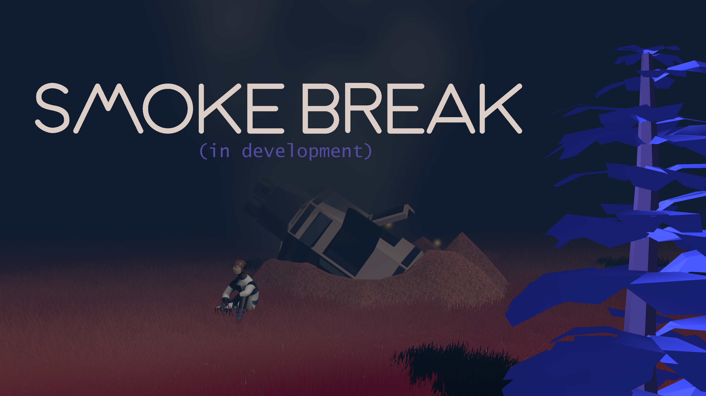

# Smoke Break 🛰️ 

A stylised survival game where **Kanta Fujimoto**, a stranded space traveller, struggles to escape the alien planet **Inari**.
Built in **Unity**, it features atmospheric exploration, scavenging, light combat, dynamic controls, enemy AI, progression systems, and a cloud save system. 

****Currently in development with a prototype in place.***



---

## 🧰 Development Environment

- **Engine**: Unity
- **Language**: C# (.NET)
- **3D Modeling**: Blender
- **Texturing / UI Art**: Adobe Photoshop

---

## 📁 Project Structure

```
smoke-break_src/
├── Assets/
│   ├── Scripts/               # C# game scripts
│   ├── Art/                   # Textures, sprites, and 3D models
│   ├── Scenes/                # Unity scene files
│   ├── Prefabs/               # Reusable game objects
│   └── UI/                    # UI components
└─────────────────
```

---

## 🚀 How to Run

### Requirements

- [Unity](https://unity.com/) (Recommended version: 2021.3+)
- [Git](https://git-scm.com/)

### Getting Started

```bash
git clone https://github.com/johnshields/smoke-break.git
```

Open the project in Unity Hub.

---

## 🎮 Gameplay (In Development)

- Explore and survive a strange and hostile planet

[More info](works/story-outline.md)

---
